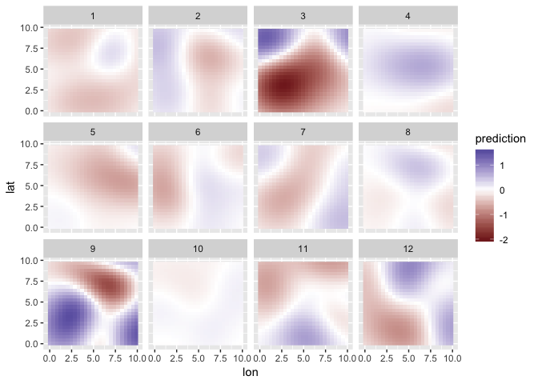

<!-- README.md is generated from README.Rmd. Please edit that file -->
<!-- glmmfields  -->
====================================================

[](https://travis-ci.org/seananderson/glmmfields)
[](https://ci.appveyor.com/project/seananderson/glmmfields)
<!-- [](https://codecov.io/github/seananderson/glmmfields) -->

The glmmfields R package implements Bayesian spatiotemporal models that
allow for extreme spatial deviations through time. It uses a predictive
process approach with random fields implemented through a multivariate-t
distribution instead of a multivariate normal. The models are fit with
[Stan](http://mc-stan.org/).

You can install the development version of the package with:

``` r
# install.packages("devtools")
devtools::install_github("seananderson/glmmfields")
```

glmmfields can also fit spatial GLMs with Stan. See the vignette:

``` r
vignette("spatial-glms", package = "glmmfields")
```

An example spatiotemporal model
-------------------------------

Simulate data:

``` r
library(glmmfields)
library(ggplot2)
set.seed(42)
s <- sim_glmmfields(
  df = 2.8, n_draws = 12, n_knots = 12, gp_theta = 2.5,
  gp_sigma = 0.2, sd_obs = 0.1
)
head(s$dat)
#>   time pt           y      lon      lat station_id
#> 1    1  1  0.02818963 9.148060 6.262453          1
#> 2    1  2 -0.21924739 9.370754 2.171577          2
#> 3    1  3 -0.34719485 2.861395 2.165673          3
#> 4    1  4 -0.15785483 8.304476 3.889450          4
#> 5    1  5 -0.04703617 6.417455 9.424557          5
#> 6    1  6 -0.23904924 5.190959 9.626080          6
```

``` r
print(s$plot)
```


Fit the model:

``` r
options(mc.cores = parallel::detectCores()) # for parallel processing
m <- glmmfields(y ~ 0,
  data = s$dat, time = "time",
  lat = "lat", lon = "lon",
  nknots = 12, estimate_df = TRUE, iter = 800
)
```

``` r
print(m)
#> Inference for Stan model: glmmfields.
#> 4 chains, each with iter=800; warmup=400; thin=1; 
#> post-warmup draws per chain=400, total post-warmup draws=1600.
#> 
#>             mean se_mean   sd    2.5%     25%     50%     75%   97.5% n_eff Rhat
#> df[1]       3.77    0.04 1.44    2.07    2.75    3.40    4.44    7.32  1204    1
#> gp_sigma    0.30    0.00 0.04    0.22    0.27    0.30    0.33    0.39   455    1
#> gp_theta    2.59    0.00 0.07    2.47    2.54    2.58    2.63    2.72  1600    1
#> sigma[1]    0.10    0.00 0.00    0.09    0.10    0.10    0.10    0.10  1600    1
#> lp__     2291.26    0.39 9.72 2270.72 2284.97 2291.75 2298.18 2309.16   619    1
#> 
#> Samples were drawn using NUTS(diag_e) at Tue Apr  3 11:41:11 2018.
#> For each parameter, n_eff is a crude measure of effective sample size,
#> and Rhat is the potential scale reduction factor on split chains (at 
#> convergence, Rhat=1).
```

Plot:

``` r
plot(m, type = "prediction") + scale_color_gradient2()
```


``` r
plot(m, type = "spatial-residual")
```


Predictions:

``` r
# link scale:
p <- predict(m)
head(p)
#> # A tibble: 6 x 3
#>   estimate conf_low conf_high
#>      <dbl>    <dbl>     <dbl>
#> 1  -0.0288  -0.0939    0.0337
#> 2  -0.291   -0.358    -0.222 
#> 3  -0.397   -0.447    -0.345 
#> 4  -0.197   -0.271    -0.124 
#> 5  -0.0377  -0.104     0.0376
#> 6  -0.217   -0.292    -0.141

# prediction intervals on new observations (include observation error):
p <- predict(m, type = "response", interval = "prediction")
head(p)
#> # A tibble: 6 x 3
#>   estimate conf_low conf_high
#>      <dbl>    <dbl>     <dbl>
#> 1  -0.0288   -0.229   0.178  
#> 2  -0.291    -0.495  -0.0948 
#> 3  -0.397    -0.594  -0.186  
#> 4  -0.197    -0.398   0.00675
#> 5  -0.0377   -0.231   0.175  
#> 6  -0.217    -0.418  -0.0102
```

Use the `tidy` method to extract parameter estimates as a data frame:

``` r
head(tidy(m, conf.int = TRUE, conf.method = "HPDinterval"))
#>                       term    estimate   std.error    conf.low   conf.high
#> 1                    df[1]  3.76534892 1.438599645  2.00094181  6.51725298
#> 2                 gp_sigma  0.30116932 0.042719316  0.21571686  0.38113939
#> 3                 gp_theta  2.58705184 0.065806143  2.46326056  2.71425282
#> 4                 sigma[1]  0.09808222 0.002140597  0.09411777  0.10221265
#> 5 spatialEffectsKnots[1,1] -0.11135049 0.036577194 -0.18114819 -0.03755901
#> 6 spatialEffectsKnots[2,1] -0.23190464 0.035715599 -0.30256461 -0.16395474
```

Make predictions on a fine-scale spatial grid:

``` r
pred_grid <- expand.grid(
  lat = seq(min(s$dat$lat), max(s$dat$lat), length.out = 25),
  lon = seq(min(s$dat$lon), max(s$dat$lon), length.out = 25),
  time = unique(s$dat$time)
)

pred_grid$prediction <- predict(m,
  newdata = pred_grid, type = "response", iter = 100, estimate_method = "median"
)$estimate

ggplot(pred_grid, aes(lon, lat, fill = prediction)) +
  facet_wrap(~time) +
  geom_raster() +
  scale_fill_gradient2()
```



References
==========

Anderson, S. A., Ward, E. J. In press. Black swans in space: modelling
spatiotemporal processes with extremes.

Latimer, A. M., S. Banerjee, H. Sang Jr, E. S. Mosher, and J. A.
Silander Jr. 2009. Hierarchical models facilitate spatial analysis of
large data sets: a case study on invasive plant species in the
northeastern United States. Ecology Letters 12:144–154.

Shelton, A. O., J. T. Thorson, E. J. Ward, and B. E. Feist. 2014.
Spatial semiparametric models improve estimates of species abundance and
distribution. Canadian Journal of Fisheries and Aquatic Sciences
71:1655–1666.
