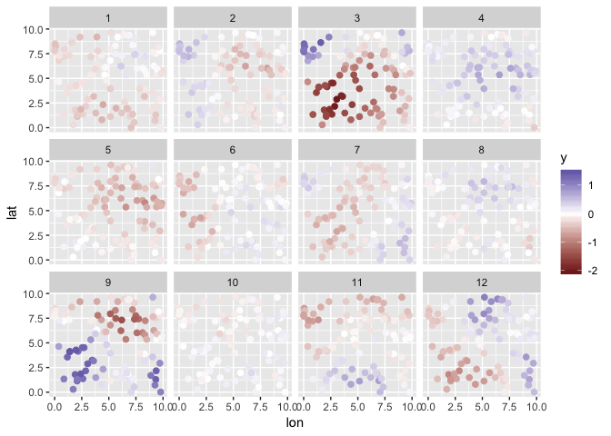
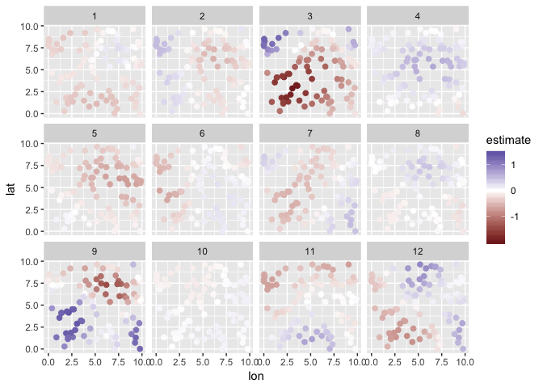
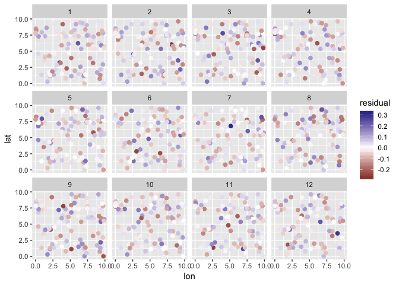

<!-- README.md is generated from README.Rmd. Please edit that file -->
rrfields
========

[](https://travis-ci.org/seananderson/rrfields) [](https://ci.appveyor.com/project/seananderson/rrfields) <!-- [](https://codecov.io/github/seananderson/rrfields) -->

The rrfields R package implements Bayesian spatiotemporal models that allow for extreme spatial deviations through time. It uses a predictive process approach with random fields implemented through a multivariate-t distribution instead of a multivariate normal. The models are fit with [Stan](http://mc-stan.org/).

You can install the development version of the package with:

``` r
# install.packages("devtools")
devtools::install_github("seananderson/rrfields")
```

An example model
----------------

Simulate data:

``` r
library(rrfields)
#> Loading required package: Rcpp
set.seed(123)
s <- sim_rrfield(df = 2.3, n_draws = 12, n_knots = 14, gp_scale = 2.5, 
  gp_sigma = 0.2, sd_obs = 0.1)
head(s$dat)
#>   time pt          y      lon      lat station_id
#> 1    1  1 -0.2295730 2.875775 5.999890          1
#> 2    1  2  0.1930647 7.883051 3.328235          2
#> 3    1  3 -0.1609730 4.089769 4.886130          3
#> 4    1  4 -0.5309184 8.830174 9.544738          4
#> 5    1  5 -0.1127621 9.404673 4.829024          5
#> 6    1  6 -0.6922423 0.455565 8.903502          6
```

``` r
print(s$plot)
```



Fit the model:

``` r
options(mc.cores = parallel::detectCores()) # for parallel processing
m <- rrfield(y ~ 0, data = s$dat, time = "time",
  lat = "lat", lon = "lon", station = "station_id", nknots = 12, iter = 600)
```

``` r
print(m)
#> Inference for Stan model: rrfield.
#> 4 chains, each with iter=600; warmup=300; thin=1; 
#> post-warmup draws per chain=300, total post-warmup draws=1200.
#> 
#>             mean se_mean   sd    2.5%     25%     50%     75%   97.5%
#> df[1]       3.60    0.07 1.47    2.06    2.55    3.19    4.13    7.91
#> gp_sigma    0.27    0.00 0.04    0.19    0.24    0.27    0.29    0.35
#> gp_scale    2.86    0.00 0.08    2.71    2.81    2.86    2.92    3.02
#> sigma[1]    0.11    0.00 0.00    0.11    0.11    0.11    0.12    0.12
#> lp__     2144.38    0.49 9.86 2123.27 2137.87 2144.63 2151.32 2162.82
#>          n_eff Rhat
#> df[1]      430 1.00
#> gp_sigma   256 1.00
#> gp_scale   749 1.01
#> sigma[1]  1200 1.00
#> lp__       400 1.01
#> 
#> Samples were drawn using NUTS(diag_e) at Thu Dec 15 20:48:35 2016.
#> For each parameter, n_eff is a crude measure of effective sample size,
#> and Rhat is the potential scale reduction factor on split chains (at 
#> convergence, Rhat=1).
```

Plot:

``` r
plot(m, type = "prediction") + ggplot2::scale_color_gradient2()
```



``` r
plot(m, type = "spatial-residual")
```



Predictions with credible intervals:

``` r
p <- predict(m)
pp <- predict(m, interval = "prediction")
plot(s$dat$y, p$estimate, col = "#00000080", xlab = "Observed", ylab = "Predicted")
segments(s$dat$y, pp$conf_low, s$dat$y, pp$conf_high, lwd = 0.5, col = "#00000020")
segments(s$dat$y, p$conf_low, s$dat$y, p$conf_high, lwd = 1, col = "#00000030")
abline(a = 0, b = 1)
```


Work with the Stan model:

``` r
library(bayesplot)
posterior <- rstan::extract(m$model, inc_warmup = FALSE, permuted = FALSE)
pars <- c("df[1]", "gp_sigma", "sigma[1]", "gp_scale")
mcmc_trace(posterior,  pars = pars)
```


``` r
mcmc_areas(as.matrix(m$model), pars = pars)
```


References
==========

Predictive-process models:

Latimer, A. M., S. Banerjee, H. Sang Jr, E. S. Mosher, and J. A. Silander Jr. 2009. Hierarchical models facilitate spatial analysis of large data sets: a case study on invasive plant species in the northeastern United States. Ecology Letters 12:144–154.

Shelton, A. O., J. T. Thorson, E. J. Ward, and B. E. Feist. 2014. Spatial semiparametric models improve estimates of species abundance and distribution. Canadian Journal of Fisheries and Aquatic Sciences 71:1655–1666.

...
